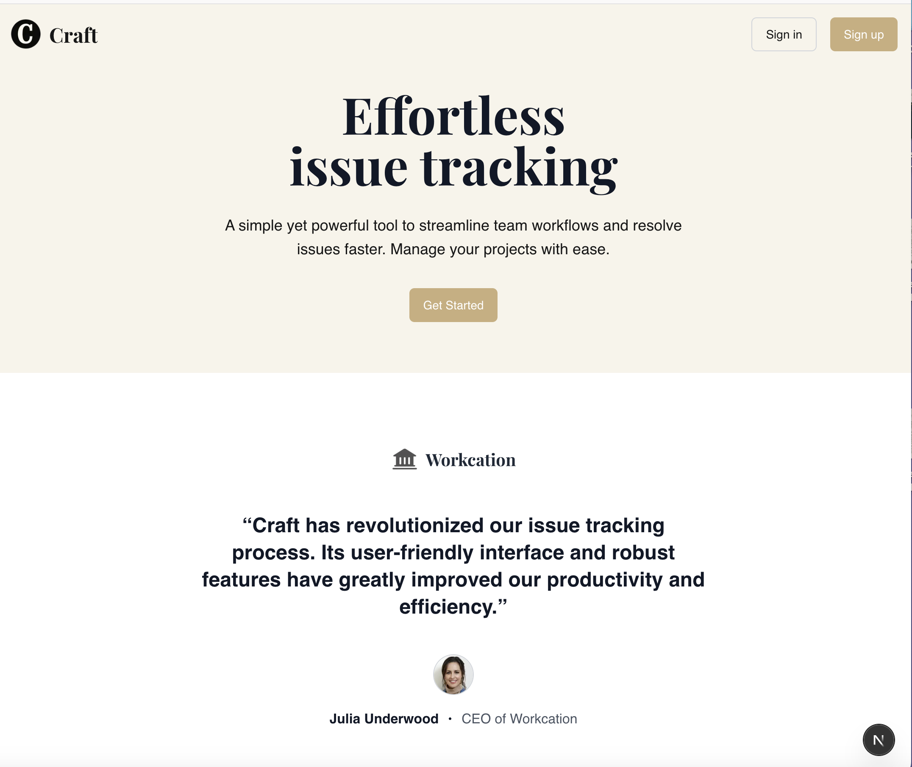
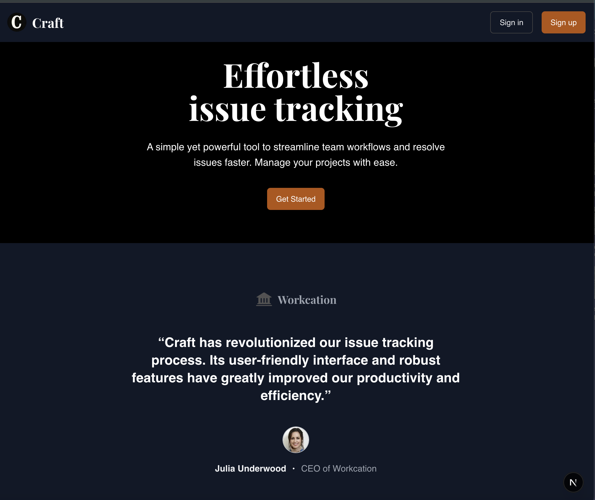
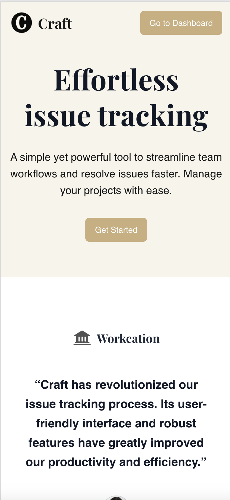
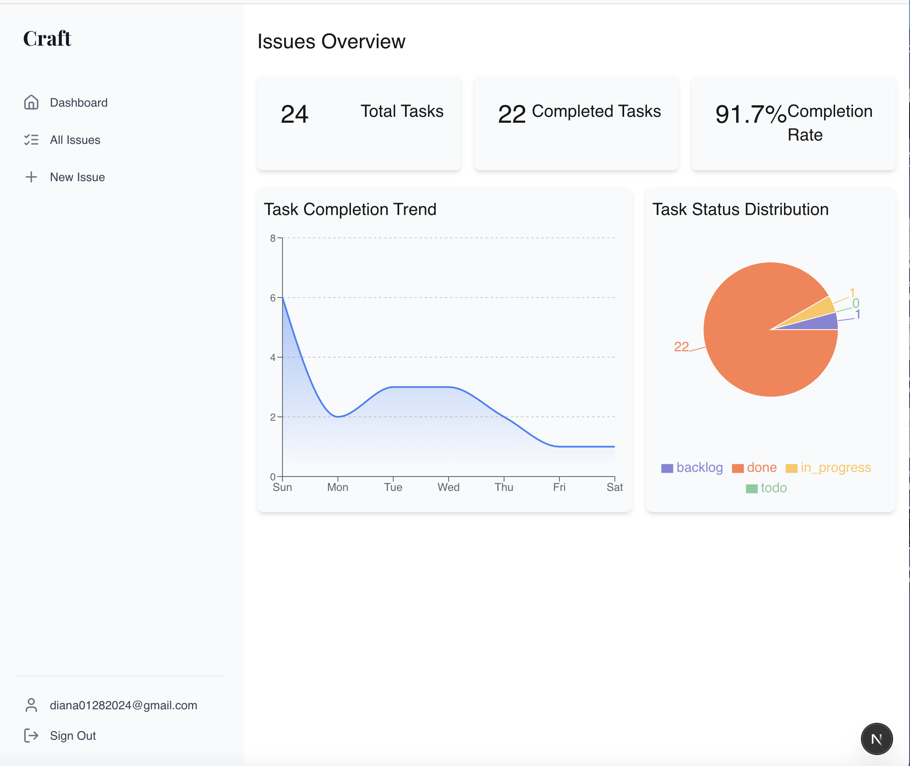
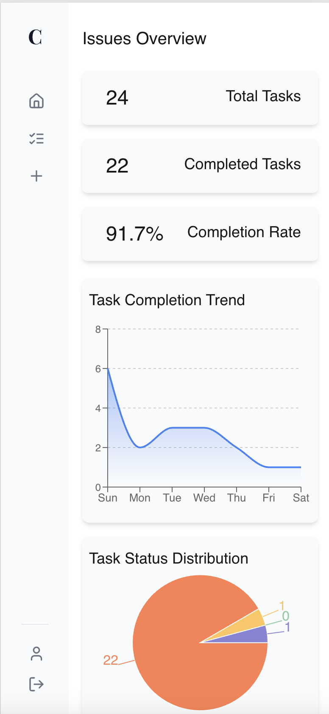
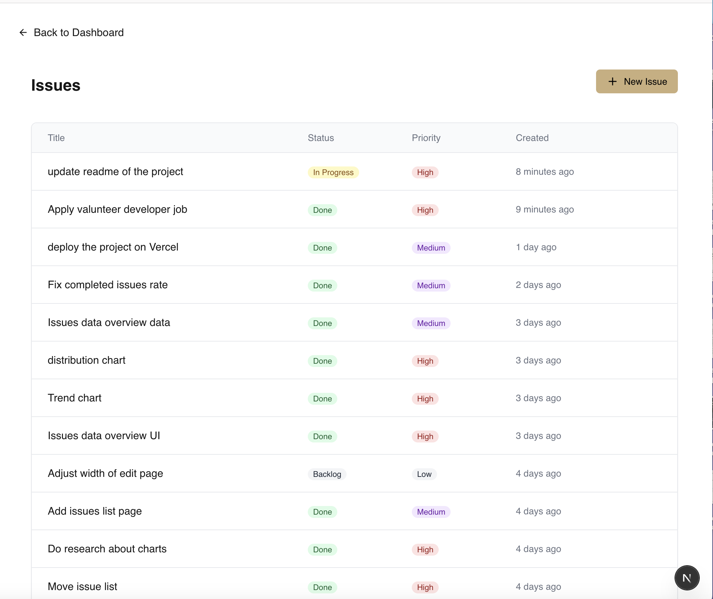
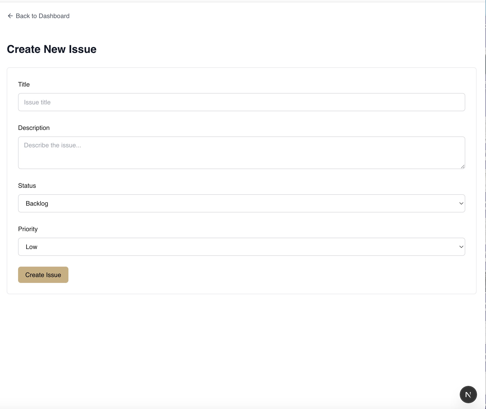

# 📝 Craft Todo App

A modern, responsive task management web application built with **Next.js 15**, **React 19**, **Tailwind CSS**, and **Drizzle ORM**. Designed for clarity, usability, and speed, this app supports task creation, filtering, and data visualization. Ideal for personal productivity or as a foundation for team-oriented tools.

🔗 **Live Demo:** [craft-todo.vercel.app](https://craft-todo-mkpnoid9w-evans-projects-4883610d.vercel.app/)

---

## ✨ Features

- ✅ Add, edit, delete, and organize tasks
- 📊 Visualize task status and priorities with charts
- 🏷️ Priority tagging and status tracking
- 🧼 Clean, responsive UI using Tailwind CSS
- 🔐 Auth system using bcrypt and jose
- 📅 Friendly date formatting with date-fns
- 📦 PostgreSQL database via Neon + Drizzle ORM

---

## 📸 Screenshots

| Main                           |
| ------------------------------ |
|  |

| Main Dark                           |
| ----------------------------------- |
|  |

| Main Mobile                       |
| --------------------------------- |
|  |

| Dashboard                                |
| ---------------------------------------- |
|  |

| Dashboard Mobile                            |
| ------------------------------------------- |
|  |

| Tasks                                 |
| ------------------------------------- |
|  |

| Task New                            |
| ----------------------------------- |
|  |

---

## 🛠️ Tech Stack

| Layer        | Technology                         |
| ------------ | ---------------------------------- |
| Frontend     | React 19, Next.js 15               |
| Styling      | Tailwind CSS, clsx, tailwind-merge |
| UI/UX        | React Hooks, react-hot-toast       |
| Validation   | Zod                                |
| Charts       | Recharts                           |
| Auth         | bcrypt, jose                       |
| ORM/Database | Drizzle ORM + Neon PostgreSQL      |
| Utilities    | date-fns, lucide-react             |

---

## 🧪 Scripts

```bash
npm run dev     # Start local dev server
npm run build   # Build production version
npm start       # Start production server
npm run lint    # Lint codebase
```
